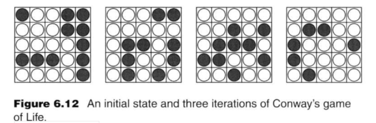
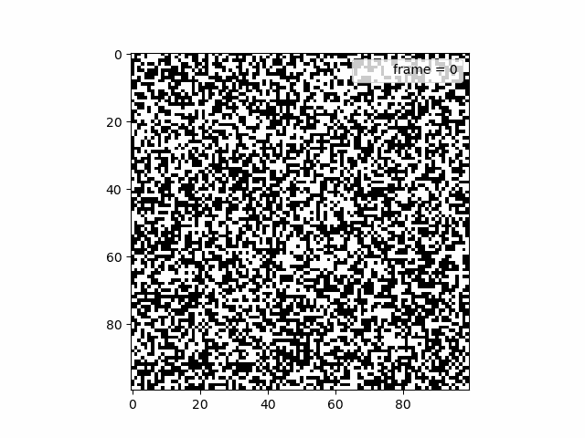

# Parallel game of life algorithm

## Arrangement of the code

Design two program. One is the program with name “Initial_array.c” which takes in two argument m and n. m and n are the dimension of initial array. It would output the array as binary format to a file named “initial_array.out” and index value m, n to a file named “index.out”. After that, the second program named “code.c” would get the value k and j from command line and read the two output files to theprogram. k is the maximum iterations while j is the number of iteration to print out the array. Subsequently, it would divide the arrayby row and assign them to different processors. Each processor follow the rule of game of life.

### compiling
* requirement
 - gcc
 - mpicc   
Use the following command in the terminal
* Initial_array.c
* suppose m=20, n=10  
'''
gcc Initial_array.c -o Initial_run

./Initial_run 20 10

'''
It would create two file initial_arry.out and index.out  
* for code.c
* suppose k=100, j=10
* suppose number of processors = 4  
'''
mpicc code.c -o run

mpirun -np 4 run 100 10

'''
the programming would output the binary file to ./output

## The rule of game of life

Life is an example of a cellular automaton. It consists of a
rectangular grid of cells. Fach cell is in one of two states: alive or dead
The game consists of a number of iterations. During each iteration a
dead cell with exactly three neighbors becomes a live cell. A live cell
with two or three neighbors stays alive. A live cell with less than two
neighbors or more than three neighbors becomes a dead cell. All cells are updated simultaneously. 

## Result
* n=m=100
* k=100
* j=1  

## Reference
[1] Quinn MJ. Parallel programming in C with MPI and OpenMP. Boston u.a.: McGraw-Hill; 2003.

